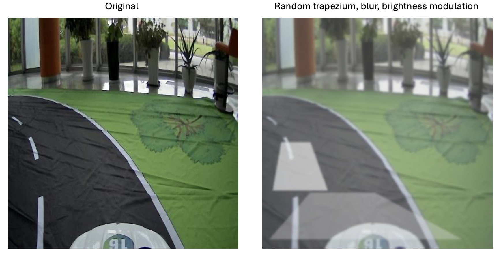
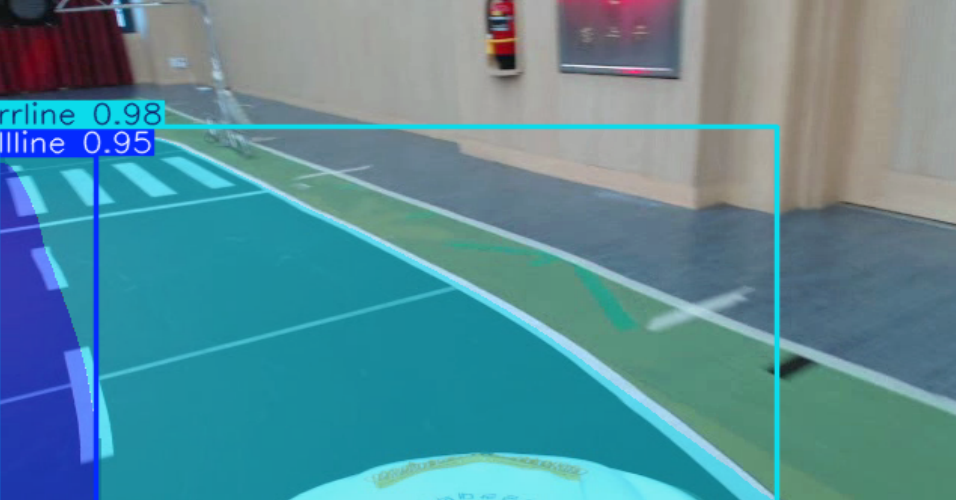
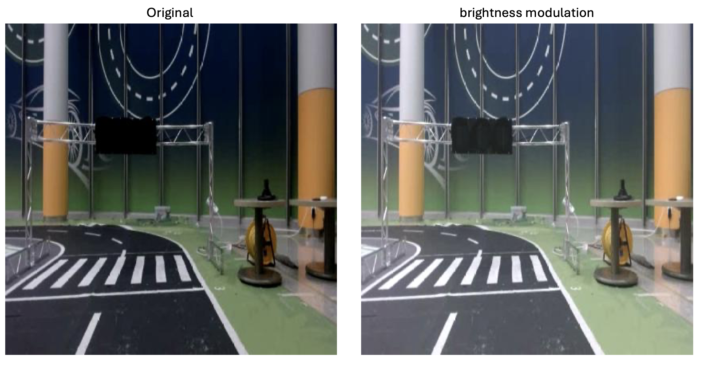
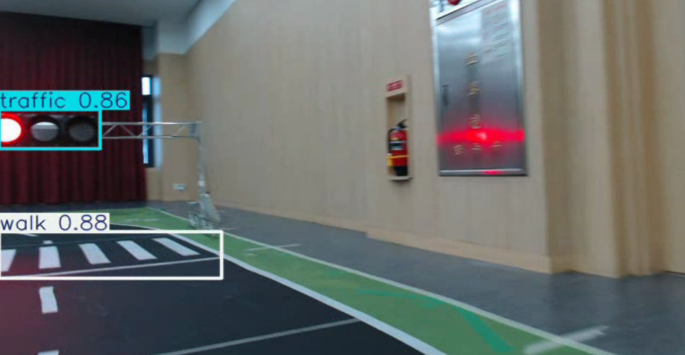

# SKKU Autonomous Driving System (2024)

Autonomous driving system developed for the **2024 Gachon University Autonomous Driving Competition**.

This project implements a full autonomous driving pipeline including **lane perception, steering control, driving object detection, and LiDAR-based vehicle detection** on a 1/5-scale electric vehicle platform.

Purpose of this project is performing autonomous driving including **self driving, avoid obstacle, recognize traffic signs, self parking**

---

# Demo

📹 **Competition Driving Demo**

Video Link : https://www.youtube.com/watch?v=FwGlec1eLXw&t=10243s

Driving : 46:06 ~ 47:56

Mission(Avoid Vehicles, Traffic Signs, Parking) : 2:49:40 ~ 2:53:20

---

# System Overview

The autonomous driving system follows a below pipelines:

**Self Driving** : Camera -> Lane Segmentation (Finetuned YOLOv8m-seg) -> Lane Geometry Extraction -> Steering Angle Calculation -> Vehicle Control

**Avoid Obstacle** : Camera -> Object Detection (Original YOLOv10x) -> Find car objects' sizes/positions -> Vehicle Control

**Recognize Traffic Signs** : Camera -> Object Detection (Finetuned YOLOv8m) -> Find traffic signs(Red/Yellow/Green) and roads' sizes/positions -> Vehicle Control

**Self Parking** : LiDAR -> Point Clustering -> Object Detection -> Vehicle Control

---

# Hardware Platform

| Component | Device |
|---|---|
| Computing | Macbook Pro M2 |
| Controller | Arduino Mega 2560 |
| Camera | Logitech C920 |
| LiDAR | RPLiDAR A1M8-R6 |
| Motor Driver | SZH-GNP521 |

Sensors are connected to the HPC via USB and the controller via serial communication.  
The controller runs motor control using **RTOS-based parallel processing**.

---

# Vehicle Hardware

### External View

### Internal System

---

# Model Training

| Device | VRAM |
|---|---|
| RTX4060Ti | 16GB |

### For Driving

Lane detection is implemented using **YOLOv8-seg**(Finetuning Head layer).

The model finetuned to detect two classes:

- left lane
- right lane

Training dataset was labeled using **Roboflow**.

Dataset split:

| Train | Validation | Test |
|---|---|---|
| 2672 | 500 | 167 |
The dataset has been extended to reflect sunlight and varying illuminance over the track. (random trapezium, blur, brigtness modulation)

sunlight / darker train dataset example

**Finetining Results**

| Model | Inferenece Time | mAP | Track invasion count|   
|---|---|---|---|
| yolov8n | 22ms | 90.90% | 1 |
| yolov8s | 48ms | 93.57% | 0 |
| **yolov8m** | **87ms** | **95.13%** | **0** |
| yolov8l | 130ms | 95.26% | 1 |
| yolov8x | 220ms | 96.92% | 1 |

For balance real-time and accuracy performances, **yolov8m** model with FPS greater than 10 and no track invasion was selected.

**Inference Reusult**

### For detecting objects

Detecting objects model is implemented using **yolov8**. This model also finetuned head layers.

Dataset split:

| Train | Validation | Test |
|---|---|---|
| 2231 | 190 | 86 |
The dataset has also been extended to adjust various illuminance environments. (brightness modulation)

brightness modulation train dataset example

**Finetuning Results**

| Model | Inference Time(with YOLOv10x) | mAP |
|---|---|---|
| yolov8n | NNms | NN.NN% |
| yolov8s | SSms | SS.SS% |
| yolov8m | MMms | MM.MM% |
| yolov8l | LLms | LL.LL% |
| yolov8x | XXms | XX.XX% |

The model that guarantees real-time driving performance and has a high mAP was **yolov8m**, so that model was selected.

**Inference Reusult**

---

# Lane Following Algorithm

The steering value is computed from lane geometry.

### Algorithm Pipeline

Steps:

1. YOLOv8-seg inference
2. Extract segmentation points
3. Split points right line / left line
4. Perspective transform (BEV)
5. RANSAC line regression
6. Convert lane angle to steering command

---

# Steering Control Example

The system calculates the steering angle from lane orientation and maps it into **40 discrete steering steps**.

---

# Straight Driving Correction

To prevent accumulated error during long straight driving, a correction algorithm was implemented.

Correction equation: D_calib = (M_set - M_img) / 30

Final steering value : D_steer = D_line + D_calib

---

# LiDAR Vehicle Detection

Vehicle detection is implemented using LiDAR clustering.

### LiDAR Clustering Result

Algorithm steps:

1. Convert polar coordinates to Cartesian
2. Cluster nearby points
3. Estimate object size
4. Classify vehicle

Detected vehicles are marked with bounding boxes.

---

# Driving Track

---

# Driving Result
- Completed **2 laps**
- **No lane violations**
- Total time: **~70.829 seconds**

---

# Project Structure
SKKU_Autonomous_Driving_2024
perception/
lane_segmentation
yolov8_model
control/
steering_control
lane_following
lidar/
lidar_clustering
vehicle_detection
controller/
serial_communication
motor_control

---

# Key Contributions

- Built a **complete autonomous driving pipeline**
- Implemented **YOLOv8 segmentation based lane detection**
- Designed **lane geometry steering algorithm**
- Developed **straight driving correction algorithm**
- Implemented **LiDAR clustering vehicle detection**
- Validated system in real-world competition environment

---

# Future Work

Future improvements:

- vision + LiDAR sensor fusion
- obstacle avoidance
- trajectory planning
- deployment on full-scale vehicles

---

# Author

Jaein Lee  
Sungkyunkwan University  
Electrical and Electronic Engineering

